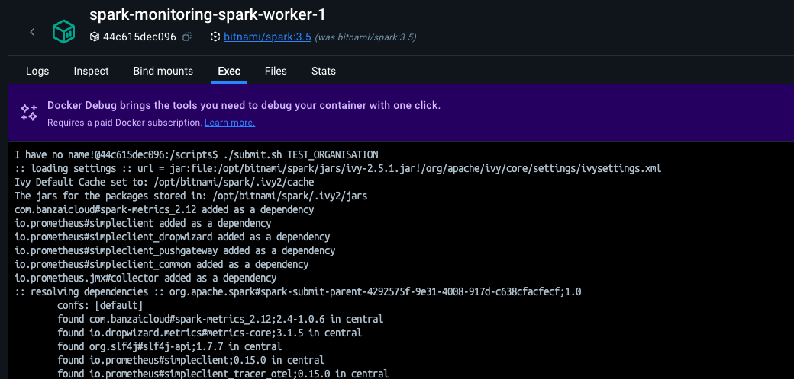
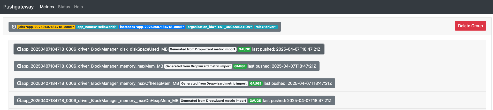

Spark metrics System
--
The system is divided into instances which correspond to internal components. Each instance
can be configured to report its metrics to one or more sinks.

```
[instance].sink.[name].[options]=[value]
```

- **[instance]** are: "master", "worker", "executor", "driver" and "applications". A
wildcard "*" can be used as instance name, in which case all instances will inherit the configuration.
- **[name]** field specifies the name of the sink.
- **[options]** field is the specific property of this sink.

**Example 1:** configuring Console as a destination
```properties
*.sink.console.class=org.apache.spark.metrics.sink.ConsoleSink
*.sink.console.period=5
*.sink.console.unit=seconds
```

**Example 2:** configuring JMX as a destination
```properties
*.sink.jmx.class=org.apache.spark.metrics.sink.JmxSink
```

**Example 3:** configuring a custom Sink implementation :: banzaicloud.PrometheusSink
- Install the jar with the custom implementation into the classpath ()
- Set the configuration
```properties
*.sink.prometheus.class=org.apache.spark.banzaicloud.metrics.sink.PrometheusSink
*.sink.prometheus.pushgateway-address-protocol=https
*.sink.prometheus.pushgateway-address=192.0.0.1:9091
*.sink.prometheus.pushgateway-enable-timestamp=false
*.sink.prometheus.unit=seconds
*.sink.prometheus.period=5
```

E2E Setup using banzaincloud.PrometheusSink
---
Step 1) Start the local environment, which consists of a spark cluster (1 master, 1 worker) and an instance of the pushgateway running.
```
docker-compose up
```

once services are up, access them via:
- Prom/Pushgateway at http://localhost:9091
- Spark UI at http://8080

Step 2) Submit the [helloworld-spark](./applications/helloworld-spark.py) application to the cluster, this can be done by connecting to one of the nodes in the cluster and using the script [submit.sh](./scripts/submit.sh)
```
./submit.sh TESTING_ORGANISATION
```



access the pushgateway ui and see the metrics flowing, note to the custom label included in the configuration used as a label to identify the organisation it belongs to.
# spark-monitoring
